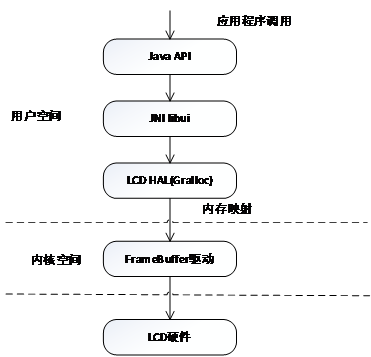

# 13.2 LCD驱动介绍
由于Linux下的LCD驱动采用了FrameBuffer技术，因此可以可以将LCD驱动称为FrameBuffer驱动。

* FrameBuffer驱动结构分析
* FrameBuffer驱动的移植
## 13.2.1 FrameBuffer驱动结构分析

FrameBuffer驱动是一个字符设备，这个驱动在文件系统中的设备节点通常是：/dev/fbX。每个系统可以有多个显示设备，使用/dev/fb0、/dev/fb1等来表示。FrameBuffer驱动的主设备号为29，此设备号递增生成（由每个FrameBuffer程序的注册顺序决定）。

FrameBuffer驱动在整个Android系统中有一个非常完善的体系结构。几乎应该有的组件都包含了。对于Android来说，包括Java层的API、UI库等，稍微底层的还有JNI Library和一些用C/C++实现的Library。直接与Linux内核交互的是HAL层的组件（*.so文件）。在Linux部分主要就是FrameBuffer驱动（包含通用的部分和与硬件相关的部分）。

在用户空间的Java API和JNI等程序库需要通过HAL与Linux内核的FrameBuffer驱动交互。在HAL层有一个名为Gralloc的硬件抽象层（HAL）模块。该模块编译后一般位于/system/lib/hw/目录中。通常的文件名为gralloc.default.so。这个链接库是在运行的过程中使用dlopen和dlsym的方式动态地打开和取出符号来使用。Grallo模块是一个可以移植的硬件抽象层。它是系统和显示设备的接口，以硬件模块的形式存在。

libui是Android在本地层次一个框架性质的集成库，它是整个AndroidGUI系统的中枢。这个库提供了一些接口，由其他的库通过类继承方式来实现，而调用者只需要调用libui库的接口即可。libui库包含了颜色格式、Egl窗口（用户显示）、按键及事件处理、Surface（显示界面）、Overlay（显示叠加层接口）、Camera（照相机接口）等多个方面的定义。

Android系统中的Gralloc、libui等组件一般并不需要对其修改。而由于各种计算设备（手机、平板电脑等）使用的LCD在屏幕分辨率、色彩度等参数不同，所以支持具体LCD的FrameBuffer驱动需要根据LCD技术参数表进行设计和编写。

FrameBuffer驱动在用户空间大多使用ioctl、mmap等文件系统的接口进行操作，ioctl用于获得和设置信息，mmap可以将FrameBuffer的内存映射到用户空间。FrameBuffer驱动也可以直接支持write操作，直接用写的方式输出显示内容。
## 13.2.2 FrameBuffer驱动的移植

* 配置内核参数
* 配置资源
* 注册设备
* 测试
