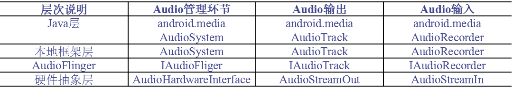

# 14.2 音频系统的层次

层次说明
Media库中的Audio框架

## 14.2.1 层次说明
* Audio本地框架类

是libmedia.so的一个部分，这些Audio接口对上层提供接口，由下层的本地代码去实现。

* AudioFlinger

继承了libmedia里面的接口，提供了实现库libaudiofilnger.so。这部分内容没有自己的对外头文件，上层调用的只是libmedia本部分的接口，但实际调用的内容是libaudioflinger.so。

* JNI

在Audio系统中，使用JNI和Java对上层提供接口，JNI部分通过调用libmedia库提供的接口来实现。

* Audio硬件抽象层

提供到硬件的接口，供AudioFlinger调用。Audio的硬件抽象层实际上是各个平台开发过程中需要主要关注和独立完成的部分。

## 14.2.2 Media库中的Audio框架
* AudioSystem.h

media库的Audio部分对上层的总管接口。

* IAudioFlinger.h

需要下层实现的总管接口。

* AudioTrack.h

放音部分对上接口。

* IAudioTrack.h

放音部分需要下层实现的接口。

* AudioRecorder.h

录音部分对上接口。

* IAudioRecorder.h

录音部分需要下层实现的接口。
