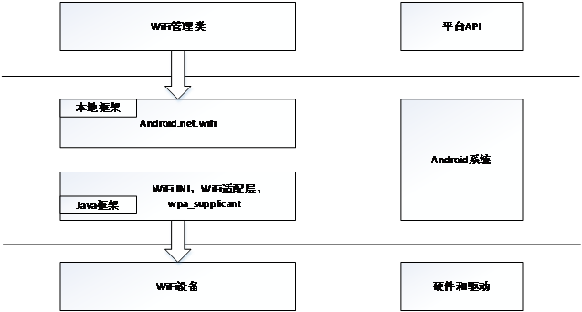

# 15.1 WiFi系统的结构

WiFi使用IEEE的802.11协议的技术，目前在智能手机中使用WiFi已经成为智能手机的核心功能之一。无线局域网的底层硬件通常是WiFi芯片，这个芯片通常提供了集成化的WiFi功能。

WiFi系统对上层的接口包括了数据部分和控制部分，数据部分就是一个通常的网络设备（与以太网非常类似），控制部分主要用于接入点操作和安全验证等。

在软件层面上，Android的WiFi系统包括Linux内核中的驱动程序和协议、本地部分，Java框架类。WiFi向Java应用程序层主要提供控制类的接口。

* Linux内核中WiFi协议和WiFi驱动程序
* wpa_supplicant可执行程序
* WiFi本地适配库
* WiFi的JNI部分
* WiFi的Java框架部分

