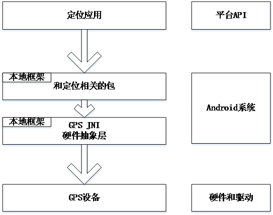
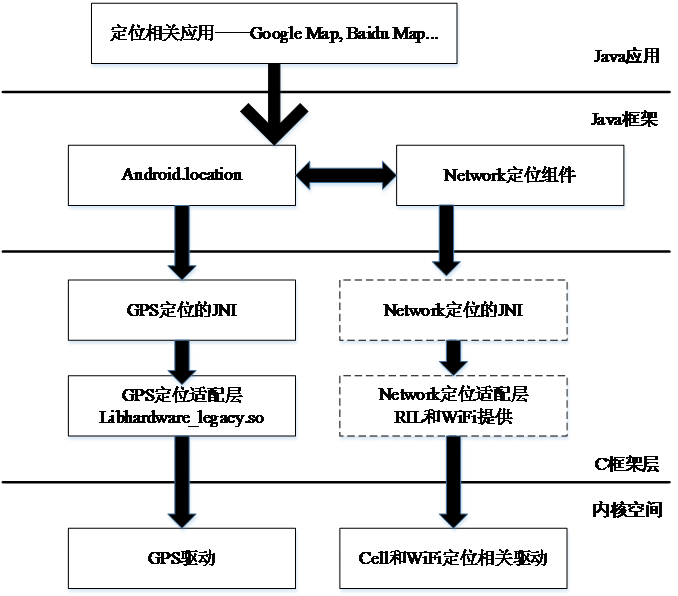

# 16.2 GPS系统的结构

Android在GPS方面有着比较系统的架构，让各种定位设备可以方便地集成进来，也让基于定位的应用开发变得更加容易。

Android定位系统的主要数据来源有两个，分别是GPS定位和Network定位（Cell基站定位和WiFi热点定位）。WiFi热点定位目前使用较少。因此，在Android中定位系统使用的硬件依然是GPS设备。

Android定位系统对上层的Java应用实现统一的接口，可以被Google地图等和定位相关的应用所使用。

* 驱动层

该层主要实现GPS等的硬件驱动，大部分GPS通过串口或USB接口连接，因此一般无需特别的照顾。
硬件抽象层（HAL层）

 硬件抽象层的主要功能被保存在如下两个目录中。

 * hardware\libhardware_legacy\gps
 * hardware\libhardware_legacy\include\hardware_legacy\gps.h

HAL层相当于一个Linux应用程序接口，通过open()和close()等函数操作硬件设备。Android的源代码只实现了模拟器的GPS接口。具体在文件gps_qemu.c中实现，在2.2版本中提供了对QCOM公司的GPS的实现。保存在“\hardware\qcom”目录中。

* JNI层

GPS部分的JNI的本地部分实现源代码保存在文件“frameworks/base/core/jni/android_location_GpsLocationLocationProvider.cpp”中。由此可见，JNI层只有一个文件，起了承上启下的作用。上层承接Framework，下层调用HAL层具体硬件抽象实现。
 
* Java框架层

GPS部分的Java层的实现代码保存在以下目录中。
frameworks/base/location/java/android//location/：外部API
frameworks/base/location/java/com/android/internal/location：提供了内部使用部分。

* Java应用层

应用层可以通过Android暴露的LocationManager接口，方便地访问GPS系统服务。目前支持GPS系统的应用非常多，基于LBS的应用也是目前一大流行趋势。

应用层内容，在packages/apps/Settings有相关一些定位系统的配置。其他主要由应用程序直接访问API接口。