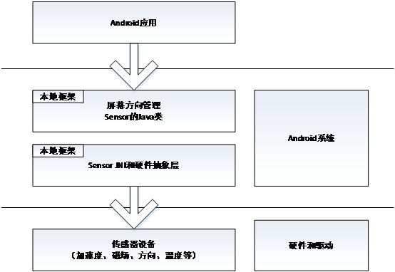

# 17.1 传感器系统的结构

Android的传感器系统用于获取外部的信息，在传感器系统下层的硬件是各种传感器设备。这些传感器包括加速度（accelerometer）、磁场（magnetic field）、方向（orientation）、陀螺测速（gyroscope）、光线——亮度（light）、压力（pressure）、温度（temperature）、接近（proximity）等8种类型。这些传感器设备基于不同的物理硬件来实现。

传感器系统对上层的接口用于主动上报传感器数据和精度变化，也提供了设置传感器的精度等接口。这些接口在Java框架和Java应用中被使用。

1.  驱动层
驱动层的代码路径是：kernel/driver/hwmon/$(PROJECT)/sensor。
在库sensor.so中提供了以下8个API函数。

 * 控制方面：在结构体ensors_control_device_t中定义。
 * * int(*open_data_source)(struct sensors_control_device_t dev)
 * * int(*activate)(struct sensors_control_device_t *def, int handle, int enabled)
 * * int(*set_delay)(struct
 sensors_control_device_t *dev, int32_t ms)
 
 * * int(*wake)(struct sensors_control_device_t *dev)

 * 数据方面：在结构体sensors_data_device_t中定义
 * * int(*data_open)(struct sensors_data_device_t *dev, int fd)
 * * int(*data_close)(struct sensors_data_device_t *dev)
 * * int(*poll)(struct sensors_data_device_t *dev, sensors_data_t *data)

 * 模块方面：在结构体sensors_module_t中定义，包括下面的一个函数。
 * * int(*get_sensors_list)(struct sensors_module_t* module, struct sensor_t const** list)

2.  传感器系统HAL层
头文件路径是：
hardware/libhardware/include/hardware/sensors.h，传感器系统的硬件抽象层需要根据所移植的平台特定实现。

3.  传感器系统的JNI部分
代码路径是：frameworks/base/core/jni/androd_hardware_SensorManager.cpp，本部分提供了android.hardware.SensorManager类的本地支持。

4.  传感器系统的Java部分
代码路径是：frameworks/base/include/core/java/android/hardware，类中包含了Camera和Sensor两部分，Sensor部分的内容为Sensor*.java文件。

5. 在Java层对传感器Java API部分的调用

在Java层次中，传感器系统提供了传感器的标准平台API，各个部分对传感器系统调用包括以下内容：

* 在Java应用中调用传感器系统的平台API
* Java框架类中调用传感器系统的平台API实现方向控制等功能
* 在Java应用程序AndroidManifest.xml定义是否根据传感器控制orientation

Android系统传感器在使用的过程中调用的要点如下所示：

* 上层注册Sensor事件的监听者
* Java类SensorManager通过JNI调用poll
* JNI在poll实现需要调用驱动程序，在有情况的时候向上返回Sensor数据
